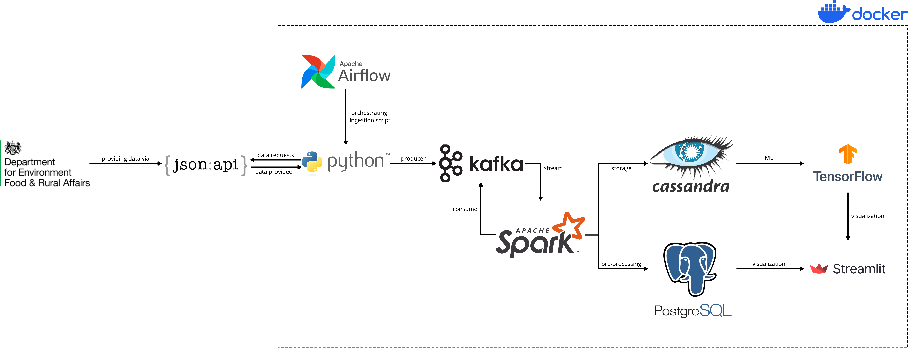

# Water level monitoring in the UK

This project aims for the development of a backend that serves a water level monitoring application in near real-time.

## Table of Contents
- [Overview](#overview)
- [Installation](#installation)
- [Usage](#usage)
- [Monitoring](#monitoring)
- [Sources](#sources)

## Overview
The following image provides an overview of the architecture that is set-up:

It is important that the focus of this project is on the architecture itself, not on the data modelling. For this reason, the data will be retrieved, pre-processed and stored in both a relational and non-relational database. However, Tensorflow is currently seen as placeholder for possible future developements based on the data. Therefore, the data is only visualized as it is stored in the PostgreSQL database.

## Installation

To run this project, you need to have Docker installed on your machine. If you don't have Docker installed, you can download it from the official website: [https://www.docker.com/products/docker-desktop/](https://www.docker.com/products/docker-desktop/)

## Usage

1. Clone the repository:

   ```shell
   git clone https://github.com/lenawe/water-level-monitoring-UK.git
   ```

2. Run the project in detached mode:

   ```shell
   docker compose up airflow-init
   docker compose up -d
   ```

3. In Docker Desktop, you can monitor the status of the container. Once the necessary containers are running, you can access the front-end app at [http://localhost:8501](http://localhost:8501). The provision of the data is scheduled. Please be aware that information about the stations will load once a week, and information about the measurements every 15 minutes. If there is a requirement to change this or run the pipelines manually, this can be done in Airflow.

## Monitoring
As part of this project, the Docker containers were operated locally. To save local resources, the graphical user intefaces are therefore deactivated as default. If these are required, the corresponding parts in [docker-compose.yml](https://github.com/lenawe/water-level-monitoring-UK/blob/main/docker-compose.yml) can be activated by commenting them out and running them. If done, they can be accessed at the following adresses:
- Airflow webserver: [http://localhost:8081](http://localhost:8081)
- Kafka UI: [http://localhost:8888](http://localhost:8888)
- Postgres UI: [http://localhost:8082](http://localhost:8082)

## Sources
Various documentation pages and blog posts have contributed to the success of the project. These include:
- https://docs.docker.com/
- https://airflow.apache.org/docs/
- https://airflow.apache.org/docs/apache-airflow/stable/tutorial/pipeline.html
- https://kafka.apache.org/documentation/
- https://cassandra.apache.org/doc/latest/
- https://www.postgresql.org/docs/
- https://docs.astronomer.io/learn/airflow-kafka
- https://docs.astronomer.io/learn/airflow-passing-data-between-tasks?tab=traditional#example-dag-using-xcoms
- https://stackoverflow.com/questions/67887138/how-to-install-packages-in-airflow-docker-compose
- https://spark.apache.org/docs/latest/
- https://github.com/apache/airflow/blob/providers-apache-kafka/1.2.0/tests/system/providers/apache/kafka/example_dag_hello_kafka.py
- https://medium.com/@dogukannulu/data-engineering-end-to-end-project-1-7a7be2a3671
- https://medium.com/@simardeep.oberoi/building-a-data-streaming-pipeline-leveraging-kafka-spark-airflow-and-docker-16527f9e9142
- https://medium.com/plumbersofdatascience/a-beginners-guide-building-your-first-dockerized-streaming-pipeline-3bd5a62046e1